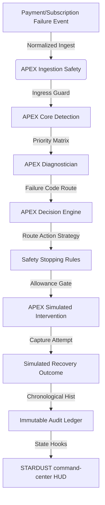

# STARDUST: Autonomous Revenue Recovery Command Center

An intelligent, self-optimizing revenue rescue engine designed to detect, diagnose, and autonomously recover failed transactions, subscription churn, abandoned checkouts, and overdue accounts.

---

## The Problem STARDUST Solves

In the digital transaction economy, revenue leakage represents a multi-billion dollar friction point. Businesses lose substantial revenue due to:
* **Passive Churn**: Expired cards or bank issues cause automated subscription renewals to fail.
* **Friction/Decline Errors**: Gateway failures, card limits, or network timeouts trigger payment declines.
* **Checkout Abandonment**: Shoppers close browser tabs during payments, resulting in lost conversions.
* **Receivable Delinquency**: Overdue invoices stall B2B accounts receivable processes.

**STARDUST** solves this by inserting **APEX 1.0 (Autonomous Payment Recovery Engine)** directly into transaction feeds, automatically assessing failure conditions and deploying targeted mitigation strategies in real-time.

---

## How STARDUST Works

STARDUST operates as an event-driven recovery coordinator. 


---

## APEX 1.0 Ingress Pipeline

The APEX engine orchestrates recovery through five consecutive processing phases:

1. **Ingest & Detection (`detector.js`)**: Evaluates incoming transaction failures, validates structural details, and assigns a Threat Priority (High, Medium, Low) using a weighted matrix.
2. **Diagnosis (`diagnostician.js`)**: Maps raw gateway failure codes to root-cause classifications (e.g. `INSUFFICIENT_FUNDS`, `CARD_EXPIRED`, `NETWORK_ERROR`).
3. **Decision (`decisionEngine.js`)**: Allocates the recovery channel (e.g. `SMART_RETRY`, `PAYMENT_METHOD_UPDATE`, `RECEIVABLES_CHASE`). Triggers support dunning escalation when attempts reach $3$.
4. **Safety Gates (`stoppingRules.js`)**: Checks hard boundaries. Halts automated actions if the transaction has been recovered, manually closed, or retry limits have been exceeded.
5. **Simulated Recovery & Audit (`recoveryEngine.js`, `auditTrail.js`)**: Runs simulated captures, records outcomes, builds a timeline (`statusHistory`), and returns deep-frozen immutable log entries to protect audit trails.

---

## Key Product Modules

* **Overview Dashboard**: UnifiedCommand console displaying recovery chart lines, live activities, reactor core status pills, active cases grids, and timeline audit logs.
* **Case Details Drawer**: Slide-over panel loading customer metadata, detailed explanations for each reasoning stage, audit history timestamps, and safe human action controls (Retry, Escalate, Close Case).
* **Search & Filters toolbar**: Real-time filters allowing users to search customer names or filter lists by status, category, and threat level.
* **Support Escalation Modal**: A compact helpdesk reporting dialog triggered from the bottom of the APEX Core status panel. Allows reviewers to select categories, submit problem logs, and confirm simulated delivery.
* **Targeted Product Tab Views**:
  * **Recovery**: Displays dunning queues, channel strategy allocations, and overall success rates.
  * **Payments**: Details failed retail transaction recovery and gateway capture rates.
  * **Subscriptions**: Tracks renewal updates, card updater links, and subscription churn risk.
  * **Invoices**: Organizes overdue B2B receivables and automated invoice chasers.
  * **Checkout**: Monitors cart abandonment values and recovery rates.
  * **Analytics**: Charts chronological trends and provides failure category analysis.

---

## Razorpay Integration Architecture

STARDUST communicates with Razorpay through a decoupled adapter service (`razorpayAdapter.js`):
* **Webhook Translators**: Listens to standard webhook events (e.g. `payment.failed`, `subscription.charged`, `invoice.expired`), maps payloads, and normalizes currency (converting **paise** to **INR**).
* **Sandbox Fallback**: If no public key ID is present, the adapter operates in **Sandbox Mode**, mock-simulating retry captures and payment links client-side.
* **API Routing & Proxy Security**: If a public key ID is configured, the adapter routes network capturing via secure serverless proxy URLs.

> [!WARNING]
> **API Key Secret Security**:
> Private credentials (such as `RAZORPAY_KEY_SECRET`) must **NEVER** be prefixed with `VITE_` or referenced in client-side bundles. Secrets must remain strictly configured on your backend server properties to prevent key exposure in public client scripts.

---

## Tech Stack

* **Core**: React 18, Vite 5, JavaScript (ES6+).
* **Styling**: Vanilla CSS (Fintech dark cinematic HUD).
* **Animations**: Framer Motion.
* **Icons**: Lucide React.
* **Build**: Vite production bundler.

---

## Local Setup Instructions

### 1. Installation
Clone the codebase and install package dependencies:
```bash
npm install
```

### 2. Environment Setup
Rename the template file `.env.example` in the root folder to `.env`:
```bash
copy .env.example .env
```
Inside `.env`, configure the Razorpay credentials placeholder:
```env
VITE_RAZORPAY_KEY_ID=rzp_test_placeholder_key_id
```

### 3. Running Development Server
Start the client-side dev server locally:
```bash
npm run dev
```
Open [http://localhost:5173](http://localhost:5173) in your browser.

### 4. Build Production Bundling
Compile files for production deployment:
```bash
npm run build
```

---

## Demo Account Credentials

For testing and local verification:
* **Account Email**: `demo@stardust.com`
* **Account Password**: `password`

---

## Limitations & Future Roadmap

* **Mock Gateways**: Direct gateway integrations are sandboxed; live processing requires deploying server-side capture controllers.
* **Persistence**: Active state is stored in-memory; future updates will introduce database mapping for persistence across sessions.
* **Automatic Updating**: Integrate real Card Updater APIs to automate expired credentials resolution.
